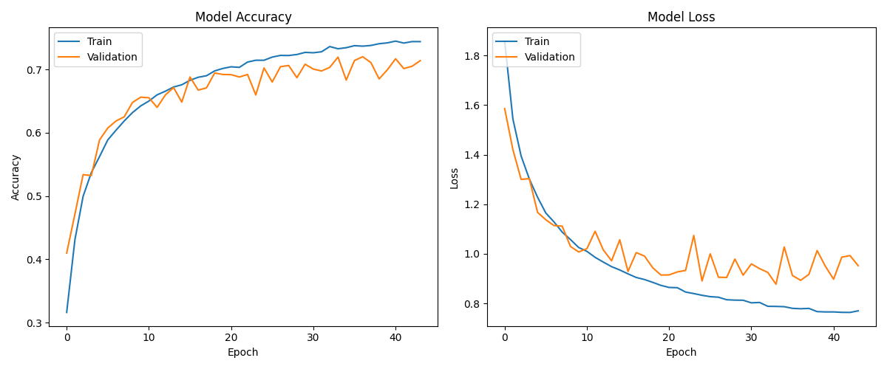

# Capstone Project: CIFAR-10 Image Classification with a CNN

## Project Goal
The objective of this project is to build, train, and tune a Convolutional Neural Network (CNN) to accurately classify images from the CIFAR-10 dataset into one of its 10 distinct classes.

## Data
The CIFAR-10 dataset contains 60,000 32x32 color images, evenly distributed across 10 classes. The dataset is pre-split into 50,000 training images and 10,000 test images.

## Architecture
The final model is a Sequential CNN built with TensorFlow/Keras. The architecture consists of two convolutional blocks for feature extraction, followed by a powerful classifier head with a bottleneck layer to control overfitting.

| Layer (type) | Output Shape | Param # |
| :--- | :--- | :--- |
| sequential_50 (Sequential) | (None, 32, 32, 3) | 0 |
| conv2d_65 (Conv2D) | (None, 30, 30, 32) | 896 |
| max_pooling2d_62 (MaxPooling2D) | (None, 15, 15, 32) | 0 |
| dropout_80 (Dropout) | (None, 15, 15, 32) | 0 |
| conv2d_66 (Conv2D) | (None, 13, 13, 64) | 18,496 |
| max_pooling2d_63 (MaxPooling2D) | (None, 6, 6, 64) | 0 |
| dropout_81 (Dropout) | (None, 6, 6, 64) | 0 |
| conv2d_67 (Conv2D) | (None, 4, 4, 32) | 18,464 |
| max_pooling2d_64 (MaxPooling2D) | (None, 2, 2, 32) | 0 |
| dropout_82 (Dropout) | (None, 2, 2, 32) | 0 |
| flatten_21 (Flatten) | (None, 128) | 0 |
| dense_63 (Dense) | (None, 256) | 33,024 |
| dropout_83 (Dropout) | (None, 256) | 0 |
| dense_64 (Dense) | (None, 32) | 8,224 |
| dense_65 (Dense) | (None, 10) | 330 |

**Total params:** 79,434 (310.29 KB)
**Trainable params:** 79,434 (310.29 KB)
**Non-trainable params:** 0 (0.00 B)

## Process
The project followed a professional, iterative machine learning workflow:
1.  **Data Loading & Preprocessing:** The CIFAR-10 dataset was loaded directly from the Keras library. Pixel values were normalized to a range between 0 and 1.
2.  **Model Building:** An initial baseline CNN was constructed.
3.  **Hyperparameter Tuning:** A methodical, multi-stage tuning process was conducted to find the optimal model. This involved scientifically experimenting with:
    * **Model Capacity:** Adjusting the width and depth of the dense layers to create a powerful baseline model capable of high training accuracy.
    * **Regularization:** Applying and fine-tuning `Dropout` and `Data Augmentation` to combat overfitting and improve the model's ability to generalize to new data.
4.  **Training & Evaluation:** The final, tuned model was trained until the validation loss stopped improving, and its performance was evaluated on the unseen test set.

## Final Results
* **Final Test Accuracy:** 0.7138
* **Final Test Loss:** 0.9519

## Conclusion
This project was a successful endeavor in building and scientifically tuning a deep learning model for a complex image classification task. Through a methodical process of experimentation, a final validation accuracy of over 72% was achieved, with the final model showing a healthy balance between learning and generalization.

### Future Work: An "Early-Epoch" Tuning Strategy
A key insight from this project is the high computational cost of tuning. A potential area for future research is to develop a more efficient cross-validation algorithm that analyzes the initial trajectory of a model's validation loss in the early epochs to intelligently prune unpromising models and dedicate more resources to those with the most potential.

## Technologies Used
- Python
- TensorFlow / Keras
- NumPy
- Matplotlib
- Pandas
